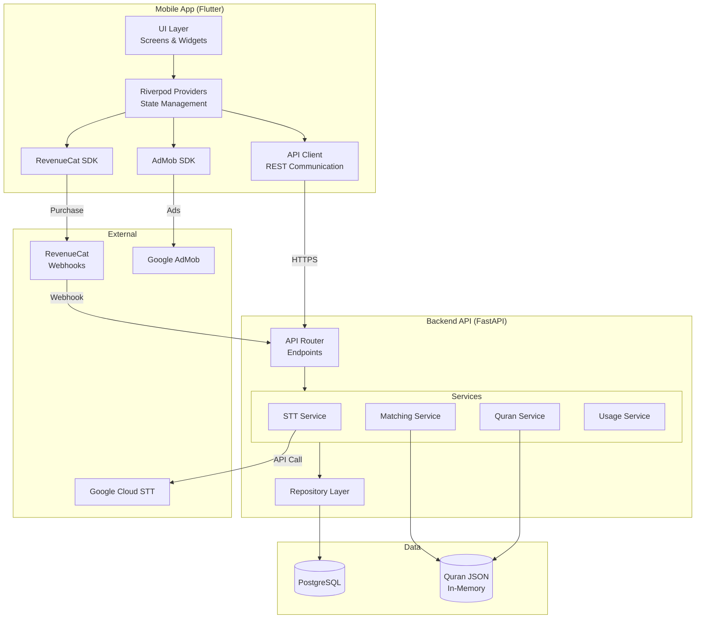

# Components

[Back to Architecture Index](../index.md)

---

## Mobile App (Flutter)

**Responsibility:** Handle user interactions, audio recording, result display, and Quran reading experience.

**Key Interfaces:**
- REST API client for backend communication
- Google Firebase SDK for analytics
- Device audio recording APIs
- Local storage for anonymous UUID

**Dependencies:** Backend API, Firebase Analytics

**Technology Stack:** Flutter 3.24.x, Dart 3.5.x, Riverpod, Clean Architecture

**Internal Structure (Feature-First Clean Architecture):**
```
mobile/
├── lib/
│   ├── app/                    # App configuration, routing
│   ├── features/
│   │   ├── recording/          # Audio capture feature
│   │   ├── results/            # Search results display
│   │   ├── quran_reader/       # In-app Quran viewer
│   │   ├── feedback/           # Thumbs up/down, ratings
│   │   ├── subscription/       # RevenueCat subscription management
│   │   ├── ads/                # Google AdMob integration
│   │   ├── usage/              # Usage tracking and limits
│   │   └── settings/           # User preferences
│   ├── core/
│   │   ├── api/                # Backend API client
│   │   ├── models/             # Data models
│   │   └── utils/              # Helpers, constants
│   └── l10n/                   # Localization
```

## Backend API (FastAPI)

**Responsibility:** Orchestrate STT transcription, execute fuzzy matching, manage user data, track subscriptions and usage.

**Key Interfaces:**
- `POST /api/v1/search` - Audio upload and verse identification (enforces usage limits)
- `POST /api/v1/feedback` - Submit search feedback
- `GET /api/v1/quran/{surah}/{ayah}` - Retrieve verse text
- `POST /api/v1/webhooks/revenuecat` - Receive subscription status updates
- `GET /api/v1/users/{user_id}/subscription` - Get subscription status
- `GET /api/v1/users/{user_id}/usage` - Get usage counters
- `POST /api/v1/users/{user_id}/bonus-search` - Grant bonus search
- `GET /api/v1/health` - Health check endpoint

**Dependencies:** Google Cloud STT, PostgreSQL, RevenueCat Webhooks, Quran JSON data

**Technology Stack:** Python 3.12, FastAPI 0.115.x, SQLAlchemy 2.0, Pydantic

**Internal Structure (Layered Architecture):**
```
backend/
├── app/
│   ├── api/v1/endpoints/       # HTTP layer (search, feedback, webhooks, users)
│   ├── core/                   # Config, security, dependencies
│   ├── services/               # Business logic (STT, matching, usage)
│   ├── repositories/           # Data access layer
│   ├── models/
│   │   ├── domain/             # SQLAlchemy models
│   │   └── schemas/            # Pydantic schemas
│   └── data/quran.json         # Quran text
```

## Component Diagram


