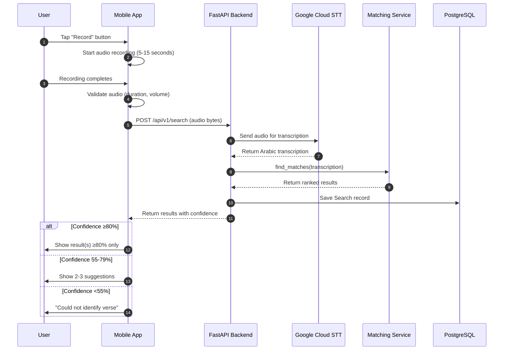
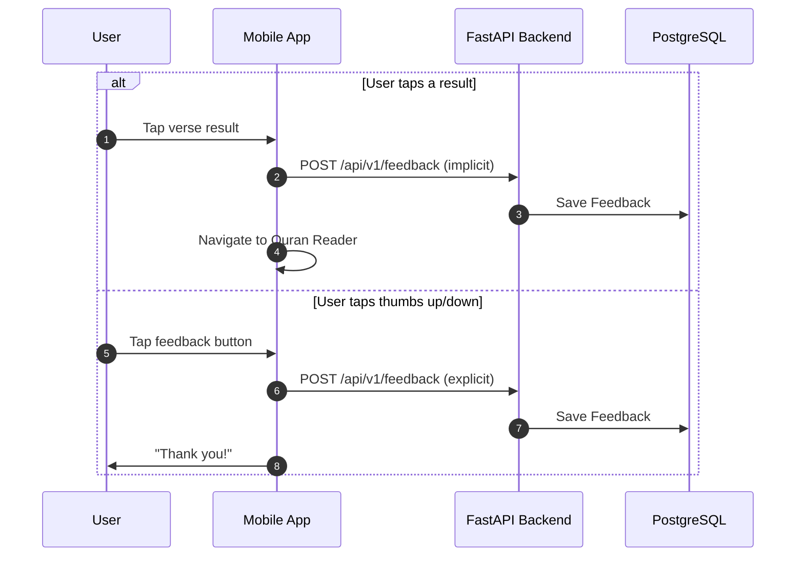
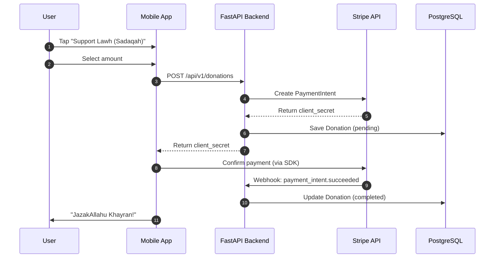

# Core Workflows

[Back to Architecture Index](../index.md)

---

## Workflow 1: Verse Identification (Primary User Journey)

```mermaid
sequenceDiagram
    autonumber
    participant User
    participant App as Mobile App
    participant API as FastAPI Backend
    participant STT as Google Cloud STT
    participant Match as Matching Service
    participant DB as PostgreSQL

    User->>App: Tap "Record" button
    App->>App: Start audio recording (5-15 seconds)
    User->>App: Recording completes

    App->>App: Validate audio (duration, volume)
    App->>API: POST /api/v1/search (audio bytes)

    API->>STT: Send audio for transcription
    STT-->>API: Return Arabic transcription

    API->>Match: find_matches(transcription)
    Match-->>API: Return ranked results

    API->>DB: Save Search record
    API-->>App: Return results with confidence

    alt Confidence ≥80%
        App->>User: Show result(s) ≥80% only
    else Confidence 55-79%
        App->>User: Show 2-3 suggestions
    else Confidence <55%
        App->>User: "Could not identify verse"
    end
```

## Workflow 2: Feedback Submission

```mermaid
sequenceDiagram
    autonumber
    participant User
    participant App as Mobile App
    participant API as FastAPI Backend
    participant DB as PostgreSQL

    alt User taps a result
        User->>App: Tap verse result
        App->>API: POST /api/v1/feedback (implicit)
        API->>DB: Save Feedback
        App->>App: Navigate to Quran Reader
    else User taps thumbs up/down
        User->>App: Tap feedback button
        App->>API: POST /api/v1/feedback (explicit)
        API->>DB: Save Feedback
        App->>User: "Thank you!"
    end
```

## Workflow 3: Sadaqah Donation

```mermaid
sequenceDiagram
    autonumber
    participant User
    participant App as Mobile App
    participant API as FastAPI Backend
    participant Stripe as Stripe API
    participant DB as PostgreSQL

    User->>App: Tap "Support Lawh (Sadaqah)"
    User->>App: Select amount

    App->>API: POST /api/v1/donations
    API->>Stripe: Create PaymentIntent
    Stripe-->>API: Return client_secret
    API->>DB: Save Donation (pending)
    API-->>App: Return client_secret

    App->>Stripe: Confirm payment (via SDK)
    Stripe->>API: Webhook: payment_intent.succeeded
    API->>DB: Update Donation (completed)
    App->>User: "JazakAllahu Khayran!"
```
