# Core Workflows

[Back to Architecture Index](../index.md)

---

## Workflow 1: Verse Identification (Primary User Journey)

## Workflow 2: Feedback Submission

## Workflow 3: Subscription Management

## Workflow 4: Usage Limit Enforcement

```mermaid
sequenceDiagram
    autonumber
    participant User
    participant App as Mobile App
    participant API as FastAPI Backend
    participant DB as PostgreSQL

    User->>App: Tap "Listen" (initiate search)
    App->>API: POST /api/v1/search

    API->>DB: Check subscription status
    API->>DB: Check usage (daily/monthly)

    alt Premium User
        API->>API: Process search (no limits)
    else Free User Under Limits
        API->>DB: Increment usage counters
        API->>API: Process search
    else Free User At Limit (has bonus)
        API->>DB: Use bonus search
        API->>API: Process search
    else Free User At Limit (no bonus)
        API-->>App: 429 Too Many Requests + usage info
        App->>User: Show limit reached screen
        User->>App: Watch rewarded ad OR upgrade
    end

    API-->>App: Return results
```

## Workflow 5: Bonus Search (Watch-to-Unlock)

