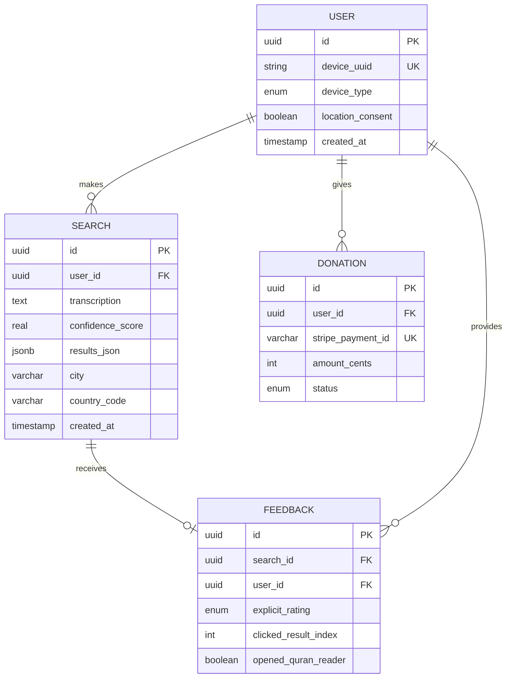

# Data Models

[Back to Architecture Index](../index.md)

---

## User

**Purpose:** Track anonymous users via device-generated UUID for linking searches and feedback without personal identification.

| Attribute | Type | Description |
|-----------|------|-------------|
| `id` | UUID (PK) | Server-generated internal ID |
| `device_uuid` | String (unique) | Device-generated anonymous UUID |
| `device_type` | Enum | `ios`, `android`, `web` |
| `app_version` | String | App version at registration |
| `location_consent` | Boolean | User opted into location tracking |
| `created_at` | Timestamp | First app launch |
| `last_active_at` | Timestamp | Most recent activity |

**Relationships:**
- Has many `Search` records
- Has many `Feedback` records
- Has many `Donation` records

## Search

**Purpose:** Record every verse identification attempt for analytics and algorithm improvement.

| Attribute | Type | Description |
|-----------|------|-------------|
| `id` | UUID (PK) | Unique search identifier |
| `user_id` | UUID (FK) | Link to User |
| `transcription` | Text | Google STT output (Arabic text) |
| `audio_duration_ms` | Integer | Recording length (10,000-15,000ms) |
| `audio_quality_score` | Float (nullable) | Client-side quality assessment |
| `top_result_surah` | Integer (nullable) | Best match surah number |
| `top_result_ayah` | Integer (nullable) | Best match ayah number |
| `confidence_score` | Float | Algorithm confidence (0.0-1.0) |
| `results_count` | Integer | Number of results shown (0, 1, 2, or 3) |
| `results_json` | JSONB | Full results array with scores |
| `processing_time_ms` | Integer | Total backend processing time |
| `stt_time_ms` | Integer | Google STT response time |
| `matching_time_ms` | Integer | Fuzzy matching time |
| `city` | String (nullable) | IP-based geolocation at search time |
| `region` | String (nullable) | IP-based geolocation at search time |
| `country_code` | String (nullable) | IP-based geolocation at search time |
| `created_at` | Timestamp | Search timestamp |

**Relationships:**
- Belongs to `User`
- Has one `Feedback` record (optional)

## Feedback

**Purpose:** Capture explicit and implicit user feedback on search results.

| Attribute | Type | Description |
|-----------|------|-------------|
| `id` | UUID (PK) | Unique feedback identifier |
| `search_id` | UUID (FK, unique) | Link to Search (1:1) |
| `user_id` | UUID (FK) | Link to User |
| `explicit_rating` | Enum (nullable) | `thumbs_up`, `thumbs_down`, `none_correct` |
| `clicked_result_index` | Integer (nullable) | Which result user tapped (0, 1, 2) |
| `time_on_results_ms` | Integer | Time spent viewing results |
| `opened_quran_reader` | Boolean | Did user open the Quran reader? |
| `created_at` | Timestamp | Feedback timestamp |

**Relationships:**
- Belongs to `Search` (one-to-one)
- Belongs to `User`

## Donation

**Purpose:** Track Sadaqah donations for sustainability monitoring.

| Attribute | Type | Description |
|-----------|------|-------------|
| `id` | UUID (PK) | Unique donation identifier |
| `user_id` | UUID (FK) | Link to User |
| `stripe_payment_id` | String | Stripe payment intent ID |
| `amount_cents` | Integer | Donation amount in cents |
| `currency` | String | Currency code (USD, GBP, etc.) |
| `status` | Enum | `pending`, `completed`, `failed`, `refunded` |
| `created_at` | Timestamp | Donation initiated |
| `completed_at` | Timestamp (nullable) | Payment confirmed |

**Relationships:**
- Belongs to `User`

## QuranVerse (JSON Structure - Not in DB)

**Purpose:** In-memory Quran text for fuzzy matching. Loaded from JSON file at startup.

```json
{
  "verses": [
    {
      "surah": 1,
      "ayah": 1,
      "text_uthmani": "بِسْمِ اللَّهِ الرَّحْمَٰنِ الرَّحِيمِ",
      "text_simple": "بسم الله الرحمن الرحيم",
      "text_no_diacritics": "بسم الله الرحمن الرحيم"
    }
  ],
  "metadata": {
    "source": "tanzil.net",
    "version": "Uthmani",
    "total_verses": 6236,
    "downloaded_at": "2026-02-10"
  }
}
```

## Entity Relationship Diagram


