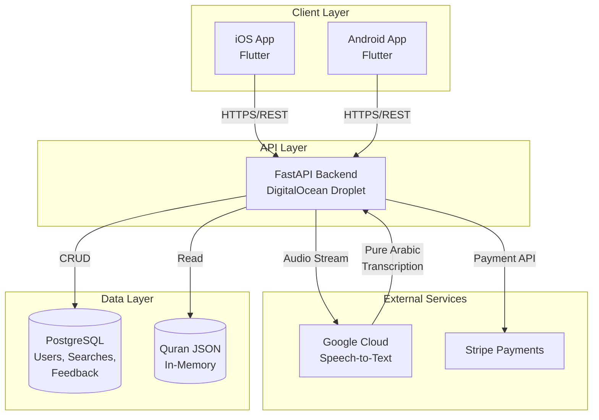

# High-Level Overview

[Back to Architecture Index](../index.md)

---

## Introduction

This document outlines the overall project architecture for **Lawh**, including backend systems, shared services, and non-UI specific concerns. Its primary goal is to serve as the guiding architectural blueprint for AI-driven development, ensuring consistency and adherence to chosen patterns and technologies.

**Relationship to Frontend Architecture:**
If the project includes a significant user interface, a separate Frontend Architecture Document will detail the frontend-specific design and MUST be used in conjunction with this document. Core technology stack choices documented herein (see "Tech Stack") are definitive for the entire project, including any frontend components.

### Starter Template or Existing Project

**Decision:** Greenfield project using full-featured starter templates

- **Backend:** FastAPI Full Stack Template (Tiangolo's) - SQLAlchemy, Alembic, JWT ready
- **Mobile:** Standard Flutter with Riverpod - Clean architecture, reactive state management

**Rationale:**
- 4-week timeline benefits from pre-configured infrastructure
- Templates handle boilerplate so focus stays on business logic (fuzzy matching, STT integration)
- Battle-tested patterns reduce risk

### Change Log

| Date | Version | Description | Author |
|------|---------|-------------|--------|
| 2026-02-10 | 1.0 | Initial architecture document creation | Winston (Architect) |

---

## High Level Architecture

### Technical Summary

Lawh is a **monolithic backend with mobile client** architecture designed for rapid MVP delivery. The system uses a Python FastAPI backend that orchestrates **Google Cloud Speech-to-Text** transcription and performs fuzzy matching against a locally-stored Quran text database. Flutter mobile clients (iOS/Android) handle audio recording and present results through a clean, culturally-appropriate interface. The architecture prioritizes simplicity, cost efficiency (<$20/month infrastructure), and fast iteration - supporting the core PRD goals of 85%+ verse identification accuracy and <5 second end-to-end response time.

### High Level Overview

1. **Architectural Style:** Monolithic Backend with REST API
2. **Repository Structure:** Monorepo (as specified in PRD)
   ```
   lawh/
   ├── mobile/          # Flutter mobile app (Riverpod + Clean Architecture)
   ├── backend/         # Python FastAPI (Full Stack Template)
   ├── shared/          # Shared assets (Quran data, constants)
   ├── docs/            # Documentation
   └── scripts/         # Build, deployment, utilities
   ```
3. **Service Architecture:** Single FastAPI service handling all business logic
4. **Primary Data Flow:**
   - User records audio → Mobile app sends to backend
   - Backend calls **Google Cloud STT** → Receives pure Arabic transcription
   - Backend runs fuzzy matching against local Quran DB
   - Results with confidence scores returned to mobile
5. **Key Decision - Google over Azure:** Testing revealed Google STT returns pure Arabic text while Azure mixed in English words - critical for accurate verse matching
6. **Audio Flow Decision:** Audio routed through backend (Option A) for API key security and future training data collection

### High Level Project Diagram



### Architectural and Design Patterns

| Pattern | Choice | Rationale |
|---------|--------|-----------|
| **API Style** | REST with JSON | Simple, well-understood, sufficient for MVP scope. GraphQL adds unnecessary complexity. |
| **Backend Structure** | Layered Architecture (Router → Service → Repository) | Clear separation of concerns, testable, matches FastAPI Full Stack Template structure. |
| **State Management (Mobile)** | Riverpod | Compile-safe, testable, no BuildContext dependency, excellent for async STT operations. |
| **Data Access** | Repository Pattern with SQLAlchemy ORM | Abstracts database operations, enables testing with mocks, future migration flexibility. |
| **Authentication** | Anonymous UUID (device-generated) | Privacy-first per PRD requirements, no user accounts for MVP. |
| **Error Handling** | Result/Either Pattern | Explicit error handling, no silent failures, clear error propagation. |
| **Configuration** | Environment Variables + Pydantic Settings | Secure secrets management, type-safe configuration, 12-factor app compliance. |
